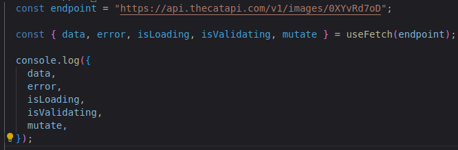
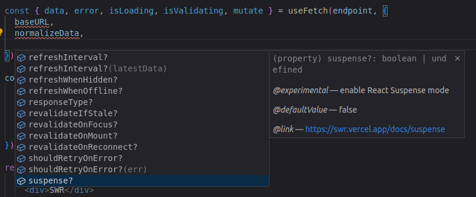

# useFetch
This code defines a custom React hook (useFetch) that leverages SWR (Stale-While-Revalidate) 
for data fetching and caching, and supports typescript.

#### How to Use

- To utilize useFetch, import it into your React component and call it with the desired URL. Here's a basic example:

```
import useFetch from './path/to/useFetch';

function MyComponent() {
  const { data, error } = useFetch('https://api.example.com/data');

  if (error) return <div>Error: {error.message}</div>;
  if (!data) return <div>Loading...</div>;

  return (
    <div>
      <h1>Data from API:</h1>
      <pre>{JSON.stringify(data, null, 2)}</pre>
    </div>
  );
}
```

#### Advanced Options

- You can also customize useFetch with advanced options as shown below:

```
import useFetch from './path/to/useFetch';

function MyComponent() {
  const { data, error } = useFetch('https://api.example.com/data', {
    normalizeData: (data) => data.results,
    cleanCacheAfterMs: 60000,
    params: { limit: 10 },
  });

  if (error) return <div>Error: {error.message}</div>;
  if (!data) return <div>Loading...</div>;

  return (
    <div>
      <h1>Normalized Data:</h1>
      <pre>{JSON.stringify(data, null, 2)}</pre>
    </div>
  );
}
```

#### Images Example
Example 1: 



--- 

Example 2:



For more details, refer to the official SWR documentation:
SWR Documentation[https://swr.vercel.app/pt-BR/docs/advanced/understanding]
